# player_project / usrCode 软件架构与运行流程

本文档描述 `usrCode` 业务代码的模块关系、线程模型，以及**细化到函数**的调用流程。  
配合 Mermaid 图在支持渲染的编辑器（VS Code、Cursor、GitHub）中查看。

---

## 0. 模块文件命名对照表

| 旧文件名 | 新文件名 | 职责 |
|----------|----------|------|
| `common.h` | `app_config.h` | 应用公共宏与 IPC 路径常量 |
| `ui_video.c/h` | `player_ui.c/h` | LVGL 播放器界面与事件回调 |
| `video_scanner.c/h` | `media_catalog.c/h` | 本地视频目录扫描与列表 |
| `mplayer_control.c/h` | `playback_controller.c/h` | MPlayer 进程启停、切歌 |
| `mplayer_status.c/h` | `playback_monitor.c/h` | 解析 slave 应答、刷新进度 |
| `thread_sync.c/h` | `playback_io_sync.c/h` | 播放 I/O 读写线程与同步 |
| `main.c` | `main.c` | 程序入口（保持不变） |

## 0.1 函数命名对照表

| 旧名称（练手命名） | 当前专业命名 | 模块 |
|--------|--------|------|
| `Myplay_video` | `ui_show_main_menu` | player_ui |
| `video_playback` | `ui_player_open_cb` | player_ui |
| `Back_btn` | `ui_player_close_cb` | player_ui |
| `(原 display_interface2 内联关闭钮)` | `ui_create_close_button` | player_ui |
| `display_interface2` | `ui_create_player_screen` | player_ui |
| `show_button_tv` | `ui_create_transport_controls` | player_ui |
| `show_list2` | `ui_create_playlist` | player_ui |
| `show_slider_tv` | `ui_create_playback_sliders` | player_ui |
| `btn_handler2` | `ui_transport_btn_cb` | player_ui |
| `slider_event_cb2` | `ui_playback_slider_cb` | player_ui |
| `event_handler_video_list` | `ui_playlist_item_cb` | player_ui |
| `get_video_path` | `media_catalog_scan` | media_catalog |
| `kill_mplayer` | `playback_stop_all` | playback_controller |
| `play_one_video` | `playback_play_current` | playback_controller |
| `play_video_task` | `playback_launch_thread` | playback_controller |
| `read_mplayer_task` | `playback_status_reader_thread` | playback_monitor |
| `write_mplayer_task` | `playback_io_query_writer_thread` | playback_io_sync |
| `signal_10_task` | `playback_io_pause_reader_on_sig` | playback_io_sync |
| `signal_12_task` | `playback_io_pause_writer_on_sig` | playback_io_sync |
| `custom_tick_get` | `app_get_tick_ms` | main |

命名约定：`ui_*` 界面与 LVGL 回调；`media_catalog_*` 媒体目录；`playback_*` 播放控制；`playback_status_*` 状态监控；`playback_io_*` I/O 线程与同步。模块文件见 §0 对照表。

---

## 1. 总体软件架构（分层 + 模块）

```mermaid
flowchart TB
    subgraph HW["Linux 硬件层"]
        FB["/dev/fb0<br/>framebuffer"]
        EV["/dev/input/event0<br/>触摸屏"]
    end

    subgraph DRV["lv_drivers（第三方）"]
        fbdev_init --> FB
        fbdev_flush --> FB
        evdev_init --> EV
        evdev_read --> EV
    end

    subgraph LVGL["LVGL 库"]
        lv_init
        lv_timer_handler
        lv_tick_inc
        lv_obj_xxx["lv_obj_* / lv_btn_* / lv_slider_* ..."]
    end

    subgraph MAIN["main.c"]
        main
        app_get_tick_ms["app_get_tick_ms()<br/>（预留，当前未用）"]
    end

    subgraph UI["player_ui.c"]
        ui_show_main_menu
        ui_player_open_cb
        ui_create_player_screen
        ui_create_close_button
        ui_create_transport_controls
        ui_create_playlist
        ui_create_playback_sliders
        ui_transport_btn_cb
        ui_playback_slider_cb
        ui_playlist_item_cb
        ui_player_close_cb
    end

    subgraph SCAN["media_catalog.c"]
        media_catalog_scan
    end

    subgraph CTRL["playback_controller.c"]
        playback_play_current
        playback_launch_thread
        playback_stop_all
    end

    subgraph STAT["playback_monitor.c"]
        playback_status_reader_thread
    end

    subgraph SYNC["playback_io_sync.c"]
        playback_io_query_writer_thread
        playback_io_pause_reader_on_sig
        playback_io_pause_writer_on_sig
    end

    subgraph PROC["外部进程"]
        MP["mplayer 子进程<br/>-slave -input file=FIFO"]
    end

    subgraph IPC["IPC"]
        FIFO["/tmp/mplayer_control<br/>命名管道 FIFO"]
        PIPE["popen 匿名管道<br/>读 stdout"]
    end

    main --> lv_init
    main --> fbdev_init
    main --> evdev_init
    main --> ui_show_main_menu
    main --> lv_timer_handler

    ui_show_main_menu --> media_catalog_scan
    ui_show_main_menu --> lv_obj_xxx

    ui_player_open_cb --> ui_create_player_screen
    ui_create_player_screen --> ui_create_close_button
    ui_create_player_screen --> ui_create_transport_controls
    ui_create_player_screen --> ui_create_playlist
    ui_create_player_screen --> ui_create_playback_sliders

    ui_playlist_item_cb --> playback_play_current
    ui_transport_btn_cb --> playback_play_current
    ui_transport_btn_cb --> write

  playback_play_current --> playback_stop_all
    playback_play_current --> playback_launch_thread
    playback_play_current --> playback_status_reader_thread
    playback_play_current --> playback_io_query_writer_thread

    playback_launch_thread --> popen
    popen --> MP
    playback_launch_thread --> write
    write --> FIFO
    FIFO --> MP

    playback_io_query_writer_thread --> write
    playback_status_reader_thread --> fgets
    fgets --> PIPE
    PIPE --> MP
    playback_status_reader_thread --> lv_obj_xxx

    ui_transport_btn_cb --> write
    ui_playback_slider_cb --> write
    ui_playback_slider_cb --> pthread_kill
    ui_playback_slider_cb --> playback_io_pause_reader_on_sig

    MP --> PIPE
    MP --> FIFO
```

---

## 2. 线程与进程模型

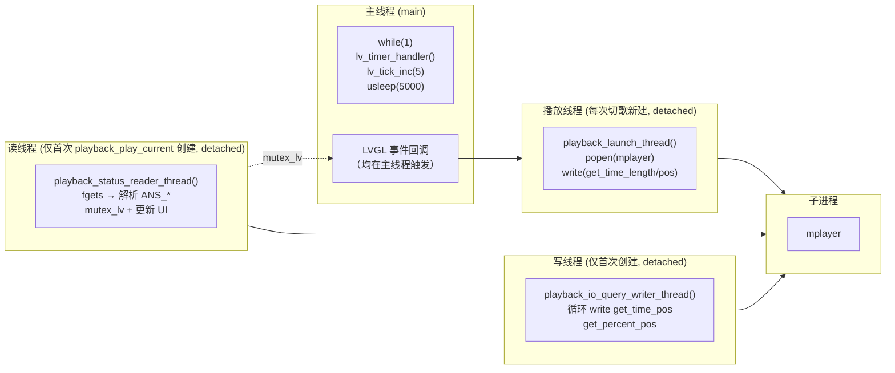

| 线程/进程 | 入口函数 | 创建时机 | 作用 |
|-----------|----------|----------|------|
| 主线程 | `main()` | 程序启动 | LVGL、触摸事件、控件创建 |
| 播放线程 | `playback_launch_thread()` | 每次 `playback_play_current()` | `popen` 启动 mplayer |
| 读线程 | `playback_status_reader_thread()` | 首次 `playback_play_current()` 且 `start==0` | 解析 slave 应答，更新进度 |
| 写线程 | `playback_io_query_writer_thread()` | 同上 | 定时向 FIFO 发查询命令 |
| mplayer | `exec` via `popen` | `playback_launch_thread` 内 | 解码播放 |

---

## 3. 模块依赖（头文件 include 关系）

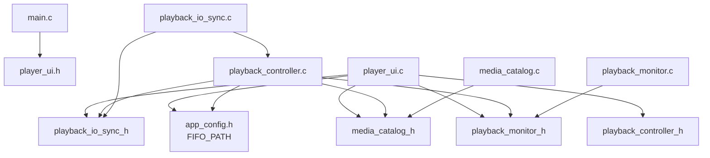

---

## 4. 静态函数调用关系总图（usrCode 内部）

```mermaid
flowchart TD
    main["main()"]

    main --> ui_show_main_menu
    main --> lv_init
    main --> fbdev_init
    main --> lv_disp_draw_buf_init
    main --> lv_disp_drv_init
    main --> lv_disp_drv_register
    main --> evdev_init
    main --> lv_indev_drv_init
    main --> lv_indev_drv_register
    main --> lv_timer_handler
    main --> lv_tick_inc
    main --> usleep

    ui_show_main_menu --> media_catalog_scan
    ui_show_main_menu --> lv_obj_create
    ui_show_main_menu --> lv_btn_create
    ui_show_main_menu --> lv_obj_add_event_cb

    lv_obj_add_event_cb -.->|RELEASED| ui_player_open_cb

    ui_player_open_cb --> access
    ui_player_open_cb --> mkfifo
    ui_player_open_cb --> open
    ui_player_open_cb --> ui_create_player_screen

    ui_create_player_screen --> lv_obj_create
    ui_create_player_screen --> ui_create_close_button
    ui_create_player_screen --> ui_create_transport_controls
    ui_create_player_screen --> ui_create_playlist
    ui_create_player_screen --> ui_create_playback_sliders

    ui_create_close_button --> lv_btn_create
    ui_create_close_button --> lv_obj_add_event_cb

    lv_obj_add_event_cb -.->|RELEASED| ui_player_close_cb

    ui_create_transport_controls --> lv_btn_create
    ui_create_transport_controls --> lv_obj_add_event_cb

    lv_obj_add_event_cb -.->|CLICKED| ui_transport_btn_cb

    ui_create_playlist --> lv_list_create
    ui_create_playlist --> lv_list_add_btn
    ui_create_playlist --> lv_obj_add_event_cb

    lv_obj_add_event_cb -.->|CLICKED| ui_playlist_item_cb

    ui_create_playback_sliders --> lv_slider_create
    ui_create_playback_sliders --> lv_obj_add_event_cb

    lv_obj_add_event_cb -.->|VALUE_CHANGED / RELEASED| ui_playback_slider_cb

    ui_playlist_item_cb --> playback_play_current

    ui_transport_btn_cb --> playback_play_current
    ui_transport_btn_cb --> pthread_kill
    ui_transport_btn_cb --> system
    ui_transport_btn_cb --> write
    ui_transport_btn_cb --> pthread_cond_signal

    ui_playback_slider_cb --> pthread_kill
    ui_playback_slider_cb --> system
    ui_playback_slider_cb --> write
    ui_playback_slider_cb --> pthread_cond_signal
    ui_playback_slider_cb --> lv_slider_get_value

    ui_player_close_cb --> system
    ui_player_close_cb --> lv_obj_del

    playback_play_current --> playback_stop_all
    playback_play_current --> usleep
    playback_play_current --> pthread_create
    playback_play_current --> pthread_detach
    playback_play_current --> sleep
    playback_play_current --> pthread_cond_signal
    playback_play_current --> write
    playback_play_current --> lv_slider_get_value

    pthread_create -.->|playback_launch_thread| playback_launch_thread
    pthread_create -.->|playback_status_reader_thread| playback_status_reader_thread
    pthread_create -.->|playback_io_query_writer_thread| playback_io_query_writer_thread

    playback_stop_all --> system

    playback_launch_thread --> popen
    playback_launch_thread --> write
    playback_launch_thread --> perror

    playback_status_reader_thread --> signal
    playback_status_reader_thread --> fgets
    playback_status_reader_thread --> strstr
    playback_status_reader_thread --> sscanf
    playback_status_reader_thread --> pthread_mutex_lock
    playback_status_reader_thread --> lv_label_set_text
    playback_status_reader_thread --> lv_slider_set_value
    playback_status_reader_thread --> pthread_mutex_unlock
    playback_status_reader_thread --> playback_play_current

    playback_io_query_writer_thread --> signal
    playback_io_query_writer_thread --> write
    playback_io_query_writer_thread --> usleep

    pthread_kill -.->|SIG 10| playback_io_pause_reader_on_sig
    pthread_kill -.->|SIG 12| playback_io_pause_writer_on_sig

    playback_io_pause_reader_on_sig --> pthread_kill
    playback_io_pause_reader_on_sig --> pthread_cond_wait
    playback_io_pause_reader_on_sig --> pthread_cond_signal

    playback_io_pause_writer_on_sig --> pthread_cond_wait
```

> 虚线箭头：由 LVGL 事件系统或 `pthread_create` / `pthread_kill` **间接**调用，非直接 C 调用。

---

## 5. 运行流程一：程序启动

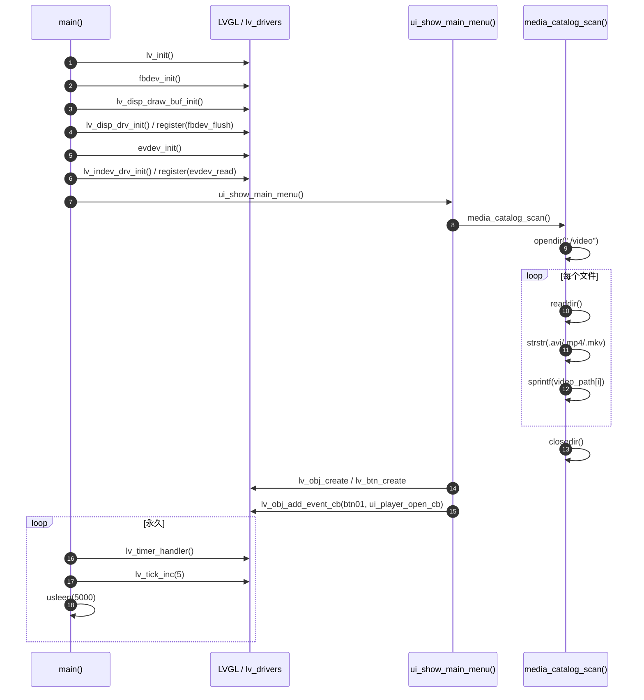

---

## 6. 运行流程二：进入播放界面（尚未播放）

用户点击主菜单 **video** 按钮。

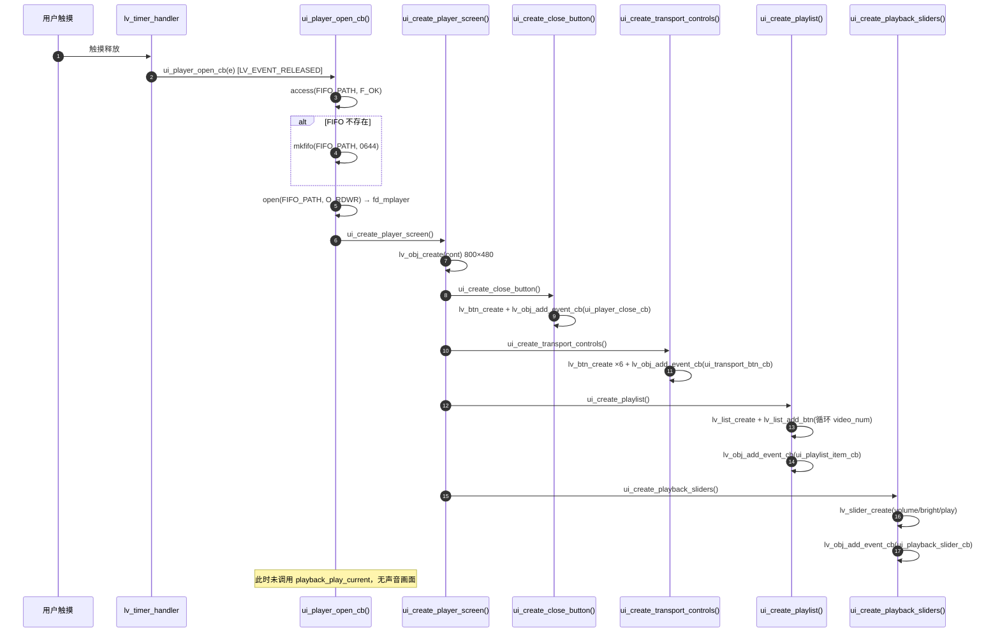

---

## 7. 运行流程三：点击列表项开始播放（首次）

假设 `start == 0`，`video_index` 被设为列表下标 `i`。

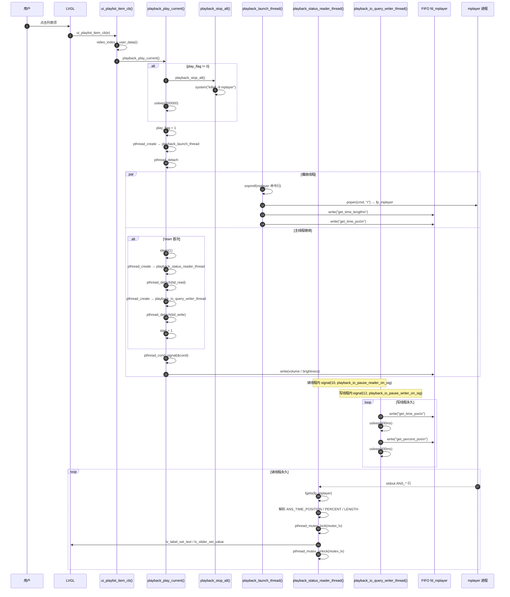

---

## 8. 运行流程四：播放中拖动进度条（seek）

触发：`ui_playback_slider_cb`，事件 `LV_EVENT_RELEASED`，`user_data == "play"`。

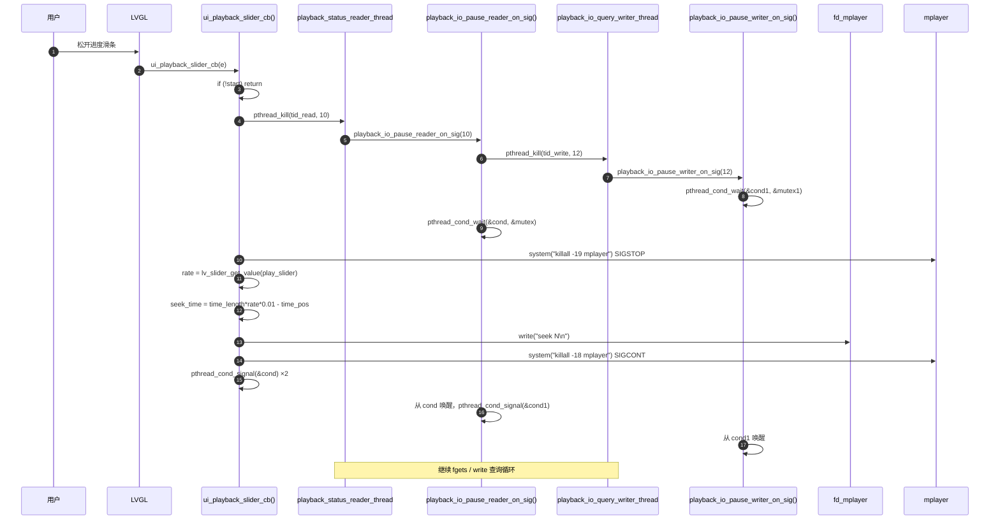

---

## 9. 运行流程五：暂停 / 继续

| 按钮 | 回调 | 关键调用 |
|------|------|----------|
| 暂停 | `ui_transport_btn_cb` ("pause") | `pthread_kill(tid_read,10)` → `system("killall -19 mplayer")` |
| 播放 | `ui_transport_btn_cb` ("play") | `system("killall -18 mplayer")` → `pthread_cond_signal(&cond)` ×2 |

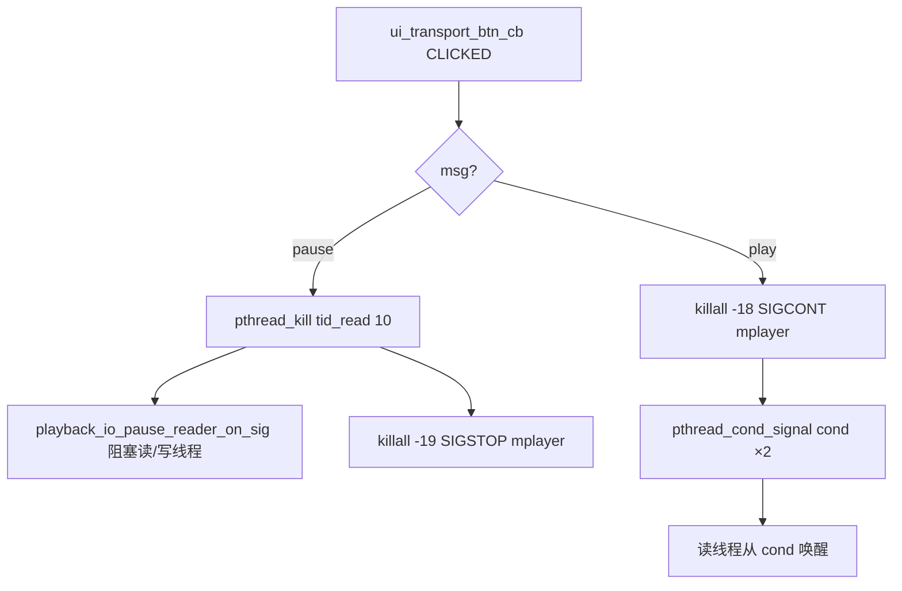

---

## 10. 运行流程六：快进 / 快退 / 上一曲 / 下一曲

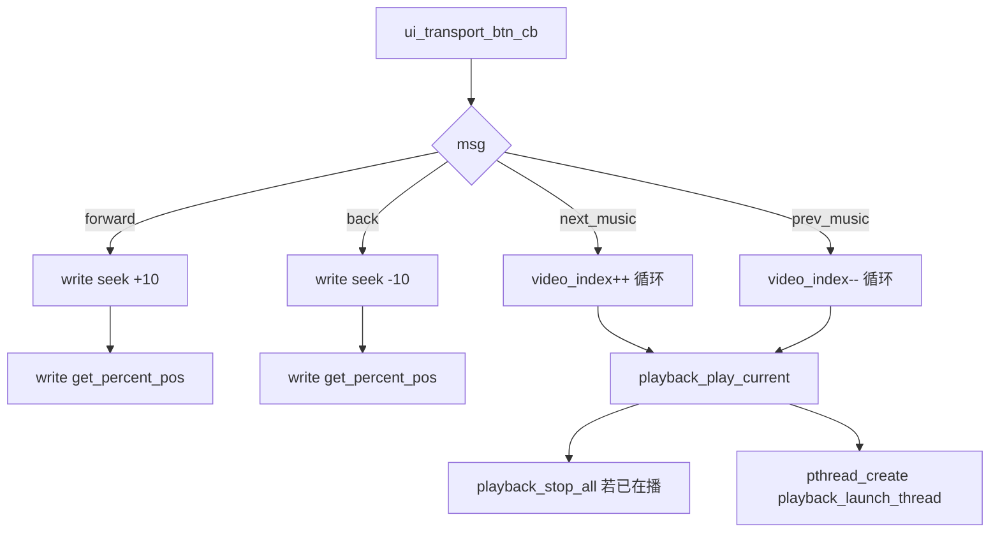

---

## 11. 运行流程七：自动下一首（播放到 99%）

在 `playback_status_reader_thread()` 内解析 `ANS_PERCENT_POSITION`：

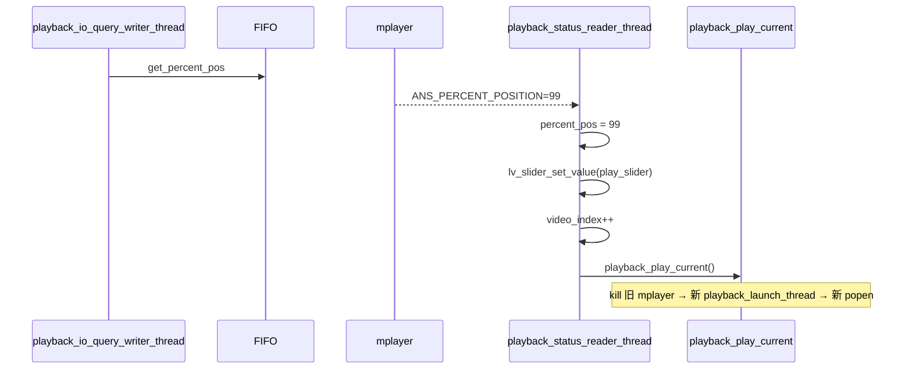

---

## 12. 运行流程八：关闭播放页

用户点击右上角 **X**。

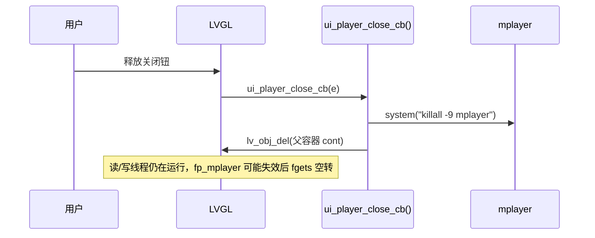

---

## 13. 全局变量与函数对照（跨模块）

| 变量 | 定义位置 | 主要读 | 主要写 |
|------|----------|--------|--------|
| `video_path[]`, `video_num` | media_catalog.c | ui, control | media_catalog_scan |
| `fd_mplayer` | playback_controller.c | ui, sync, control | ui_player_open_cb, playback_launch_thread |
| `fp_mplayer` | playback_controller.c | playback_monitor | playback_launch_thread |
| `video_index` | playback_controller.c | ui, control, status | ui 列表/按钮, status 自动下一首 |
| `start`, `play_flag` | playback_controller.c | ui, control | playback_play_current |
| `time_pos`, `time_length`, `percent_pos` | playback_monitor.c | ui seek | playback_status_reader_thread |
| `tid_read`, `tid_write` | playback_io_sync.c | ui, sync | playback_play_current |
| `cond`, `cond1`, `mutex*` | playback_io_sync.c | ui, sync | playback_io_pause_* / slider / btn |

---

## 14. 函数清单（usrCode 业务）

| 文件 | 函数 | 可见性 | 调用者 |
|------|------|--------|--------|
| main.c | `main` | 全局 | 系统 |
| main.c | `app_get_tick_ms` | 全局 | （未链接到 LV_TICK_CUSTOM） |
| media_catalog.c | `media_catalog_scan` | 全局 | ui_show_main_menu |
| player_ui.c | `ui_show_main_menu` | 全局 | main |
| player_ui.c | `ui_player_open_cb` | 全局 | LVGL 事件 |
| player_ui.c | `ui_player_close_cb` | 全局 | LVGL 事件 |
| player_ui.c | `ui_create_player_screen` | static | ui_player_open_cb |
| player_ui.c | `ui_create_close_button` | static | ui_create_player_screen |
| player_ui.c | `ui_create_transport_controls` | static | ui_create_player_screen |
| player_ui.c | `ui_create_playlist` | static | ui_create_player_screen |
| player_ui.c | `ui_create_playback_sliders` | static | ui_create_player_screen |
| player_ui.c | `ui_transport_btn_cb` | static | LVGL 事件 |
| player_ui.c | `ui_playback_slider_cb` | static | LVGL 事件 |
| player_ui.c | `ui_playlist_item_cb` | static | LVGL 事件 |
| playback_controller.c | `playback_stop_all` | 全局 | playback_play_current, ui_player_close_cb(间接) |
| playback_controller.c | `playback_play_current` | 全局 | player_ui, playback_monitor |
| playback_controller.c | `playback_launch_thread` | 全局 | pthread_create |
| playback_monitor.c | `playback_status_reader_thread` | 全局 | pthread_create |
| playback_io_sync.c | `playback_io_query_writer_thread` | 全局 | pthread_create |
| playback_io_sync.c | `playback_io_pause_reader_on_sig` | 全局 | signal / pthread_kill |
| playback_io_sync.c | `playback_io_pause_writer_on_sig` | 全局 | signal / pthread_kill |

---

*文档版本与 `usrCode` 源码同步；若增删函数请一并更新本文件。*
